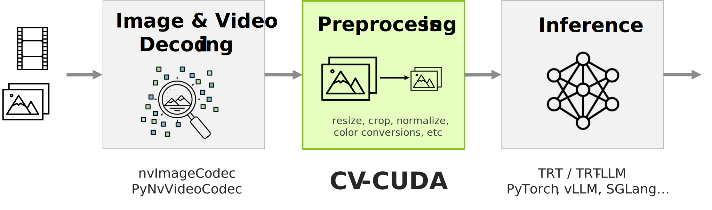
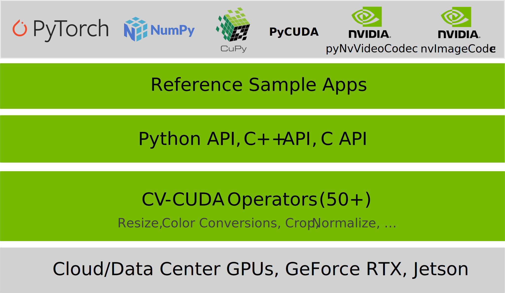

[//]: # "SPDX-FileCopyrightText: Copyright (c) 2022-2025 NVIDIA CORPORATION & AFFILIATES. All rights reserved."
[//]: # "SPDX-License-Identifier: Apache-2.0"
[//]: # ""
[//]: # "Licensed under the Apache License, Version 2.0 (the 'License');"
[//]: # "you may not use this file except in compliance with the License."
[//]: # "You may obtain a copy of the License at"
[//]: # "http://www.apache.org/licenses/LICENSE-2.0"
[//]: # ""
[//]: # "Unless required by applicable law or agreed to in writing, software"
[//]: # "distributed under the License is distributed on an 'AS IS' BASIS"
[//]: # "WITHOUT WARRANTIES OR CONDITIONS OF ANY KIND, either express or implied."
[//]: # "See the License for the specific language governing permissions and"
[//]: # "limitations under the License."

# CV-CUDA


[](https://pypi.org/search/?q=cvcuda)
[](https://opensource.org/licenses/Apache-2.0)


[](https://developer.nvidia.com/cuda-toolkit-archive)
[](https://gcc.gnu.org/gcc-11/changes.html)
[](https://www.python.org/)
[](https://cmake.org/)


CV-CUDA is an open-source library of GPU-accelerated computer vision algorithms designed for speed and scalability. It delivers high-throughput, low-latency image/video processing for AI pipelines across NVIDIA cloud, desktop, and edge platforms. CV-CUDA is built for performance and works seamlessly with C/C++ and Python Image and AI frameworks.

For more information on available operators, API documentation, and getting started guides, refer to our [online documentation][CV-CUDA Documentation].





## CV-CUDA in Action

Fully GPU-accelerated image resizing with [nvImageCodec](https://docs.nvidia.com/cuda/nvimagecodec/index.html) and CV-CUDA.

```python
import cvcuda
from nvidia import nvimgcodec

# Decode image directly to GPU
decoder = nvimgcodec.Decoder()
image = decoder.read("input.jpg")

# Convert to CV-CUDA tensor and process
cvcuda_tensor = cvcuda.as_tensor(image, "HWC")
resized = cvcuda.resize(cvcuda_tensor, (224, 224, 3), cvcuda.Interp.LINEAR)
```

## Installation

CV-CUDA can be installed from pre-built packages (Python wheels, Debian packages, or tar archives) or built from source.
We provide pre-built Python wheels on pypi.org for a variety of Python versions (3.9 to 3.14) and Linux-based platforms (x86_64 and aarch64). See [cvcuda-cu12] and [cvcuda-cu13] for CUDA 12 and CUDA 13, respectively.

| CUDA Version | Installation Command |
|--------------|---------------------|
| CUDA 12 | `pip install cvcuda-cu12` |
| CUDA 13 | `pip install cvcuda-cu13` |

See [Installation](https://cvcuda.github.io/CV-CUDA/installation.html) for complete installation instructions including building from source, installing Debian packages, and tar archives.

### Compatibility

|CV-CUDA Build|Platform|CUDA Version|CUDA Compute Capability|Hardware Architectures|Nvidia Driver|Python Versions|Supported Compilers (build from source and API compatiblity)|API compatibility with prebuilt binaries|OS/Linux distributions tested with prebuilt packages|
|-|-|-|-|-|-|-|-|-|-|
|x86_64_cu12|x86_64|≥12.2|≥SM7.5|Turing, Ampere, Ada Lovelace, Hopper, Blackwell|≥r525**|3.9 - 3.14|gcc≥10*|gcc≥10 <br> clang≥11|ManyLinux2014-compliant, Ubuntu≥22.04<br>WSL2/Ubuntu≥22.04|
|x86_64_cu13|x86_64|≥13.0|≥SM7.5|Turing, Ampere, Ada Lovelace, Hopper, Blackwell|≥r580**|3.9 - 3.14|gcc≥10*|gcc≥10 <br> clang≥11|ManyLinux2014-compliant, Ubuntu≥22.04<br>WSL2/Ubuntu≥22.04|
|aarch64_cu12|aarch64 SBSA***|≥12.2|≥SM7.5|ARM SBSA (incl. Grace): Volta, Turing, Ampere, Ada Lovelace, Hopper, Blackwell|≥r525**|3.9 - 3.14|gcc≥10*|gcc≥10 <br> clang≥11|ManyLinux2014-compliant, Ubuntu≥22.04|
|aarch64_cu12|aarch64 Jetson***|12.2|≥SM7.5|Jetson AGX Orin, IGX Orin + Ampere RTX6000, IGX Orin + ADA RTX6000|JetPack 6.0 DP, r535 (IGX OS v0.6)|3.10|gcc≥10*|gcc≥10 <br> clang≥11|Jetson Linux 36.2<br> IGX OS v0.6|
|aarch64_cu13|aarch64 SBSA and Jetson Thor***|≥13.0|≥SM7.5|ARM SBSA (incl. Grace): Volta, Turing, Ampere, Ada Lovelace, Hopper, Blackwell, Jetson Thor|≥r580**|3.9 - 3.14|gcc≥10*|gcc≥10 <br> clang≥11|ManyLinux2014-compliant, Ubuntu≥22.04|


\* test module with partial coverage, need gcc≥11 for full coverage (see Known Limitations) <br>
\** [samples][CV-CUDA Samples] require driver ≥r535 to run. CUDA 13 requires ≥r580. <br>
\*** starting with v0.14, aarch64 packages (deb, tar.xz or wheels) distributed on Github (release "assets") or Pypi are SBSA-compatible unless noted otherwise. Jetson 6 builds (deb, tar.xz, whl) can be found in explicitly named "Jetson" archives in Github release assets. Packages marked 'aarch64_cu13' are built with the unified CUDA toolkit, compatible with both server-class and embedded platforms (Jetson Thor).

### Known limitations

- CV-CUDA does not currently support native Windows, only [WSL2](https://cvcuda.github.io/CV-CUDA/wsl2.html)
- Starting with v0.16, CV-CUDA is dropping official support for CUDA 11, SM7 (Volta), Ubuntu 20.04, Python 3.8.
- Starting with v0.14, aarch64 packages (deb, tar.xz or wheels) distributed on Github (release "assets") and Pypi are the SBSA-compatible ones. Jetson builds (deb, tar.xz, whl) can be found in explicitly named "Jetson" archives in Github release assets.
- The C++ test module builds with gcc≥10 with partial coverage. Full coverage requires gcc≥11 with full C++20 support (NTTP).
- [CV-CUDA Samples] require driver ≥r535 to run and are only officially supported with CUDA 12.
- Only one CUDA version (CUDA 12.x or CUDA 13.x) of CV-CUDA packages (Debian packages, tarballs, Python Wheels) can be installed at a time. Please uninstall all packages from a given CUDA version before installing packages from a different version.
- The Resize and RandomResizedCrop operators incorrectly interpolate pixel values near the boundary of an image or tensor when using cubic interpolation. This will be fixed in an upcoming release.
- The OSD operator's text rendering functionality has known issues on Jetson/aarch64 platforms, to be fixed in an upcoming release.

## Contributing

CV-CUDA is an open source project. As part of the Open Source Community, we are
committed to the cycle of learning, improving, and updating that makes this
community thrive. However, CV-CUDA is not yet ready
for external contributions.

To report a bug, request a new feature, or ask a general question, please file a [GitHub issue](https://github.com/CVCUDA/CV-CUDA/issues/new/choose).

To understand our commitment to the Open
Source Community, and providing an environment that both supports and respects
the efforts of all contributors, please read our
[Code of Conduct](CODE_OF_CONDUCT.md).

## License

CV-CUDA operates under the [Apache-2.0](LICENSE.md) license.

## Security

CV-CUDA, as a NVIDIA program, is committed to secure development practices.
Please read our [Security](SECURITY.md) page to learn more.

## Acknowledgements

CV-CUDA originated as a collaboration between [NVIDIA][NVIDIA Develop] and [ByteDance][ByteDance].

## References:

- [CV-CUDA Online Documentation][CV-CUDA Documentation]
- [Optimizing Microsoft Bing Visual Search with NVIDIA Accelerated Libraries][bing-blog]
- [Accelerating AI Pipelines: Boosting Visual Search Efficiency, GTC 2025][bing-gtc25]
- [Optimize Short-Form Video Processing Toward the Speed of Light, GTC 2025][cosmos-splitting-gtc25]
- [CV-CUDA Increasing Throughput and Reducing Costs for AI-Based Computer Vision with CV-CUDA][increased-throughput-blog]
- [NVIDIA Announces Microsoft, Tencent, Baidu Adopting CV-CUDA for Computer Vision AI][cv-cuda-announcement]
- [CV-CUDA helps Tencent Cloud audio and video PaaS platform achieve full-process GPU acceleration for video enhancement AI][tencent-blog]

[CV-CUDA Documentation]: https://cvcuda.github.io/CV-CUDA/
[NVIDIA Develop]: https://developer.nvidia.com/
[ByteDance]: https://www.bytedance.com/
[CV-CUDA GitHub Releases]: https://github.com/CVCUDA/CV-CUDA/releases
[CV-CUDA Samples]: https://github.com/CVCUDA/CV-CUDA/blob/main/samples/README.md
[cvcuda-cu12]: https://pypi.org/project/cvcuda-cu12/
[cvcuda-cu13]: https://pypi.org/project/cvcuda-cu13/

[bing-blog]: https://developer.nvidia.com/blog/optimizing-microsoft-bing-visual-search-with-nvidia-accelerated-libraries/
[bing-gtc25]: https://www.nvidia.com/en-us/on-demand/session/gtc25-s71676/
[cosmos-splitting-gtc25]: https://www.nvidia.com/en-us/on-demand/session/gtc25-s73178/
[increased-throughput-blog]: https://developer.nvidia.com/blog/increasing-throughput-and-reducing-costs-for-computer-vision-with-cv-cuda/
[cv-cuda-announcement]: https://blogs.nvidia.com/blog/2023/03/21/cv-cuda-ai-computer-vision/
[tencent-blog]: https://developer.nvidia.com/zh-cn/blog/cv-cuda-high-performance-image-processing/
